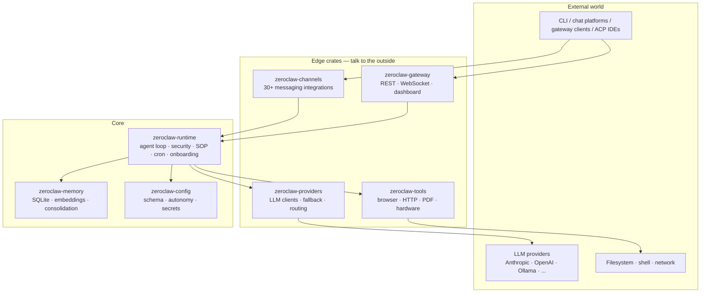
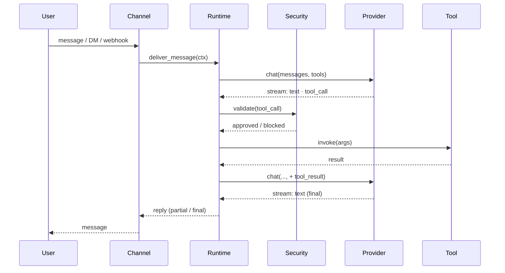

# Architecture Overview

ZeroClaw is a layered Rust workspace. At the top is the agent runtime; below it are pluggable providers, channels, tools, and memory; supporting crates handle config, sandboxing, and hardware.

## High-level shape

## Crates in scope

| Crate | Layer | Role |
|---|---|---|
| **Shared** | | |
| `zeroclaw-api` | Shared | Public traits — `Provider`, `Channel`, `Tool`, `Memory`, `Observer`, `Peripheral`. The kernel ABI |
| `zeroclaw-config` | Shared | TOML schema, secrets encryption, autonomy levels, workspace resolution |
| `zeroclaw-infra` | Shared | Tracing, metrics, structured logging |
| `zeroclaw-macros` | Shared | Derive macros for config, tool registration |
| `zeroclaw-tool-call-parser` | Shared | Model-side tool-call syntax parsing and normalisation |
| **Edge** | | |
| `zeroclaw-gateway` | Edge | HTTP / WebSocket gateway, web dashboard, webhook ingress |
| `zeroclaw-channels` | Edge | 30+ messaging integrations (Discord, Slack, Telegram, Matrix, email, voice, …) |
| `zeroclaw-tui` | Edge | Terminal UI |
| **Core** | | |
| `zeroclaw-runtime` | Core | Agent loop, security policy enforcement, SOP engine, cron scheduler, onboarding wizard |
| `zeroclaw-providers` | Core | All LLM client impls (Anthropic, OpenAI, Ollama, …) plus the router and fallback wrapper |
| `zeroclaw-tools` | Core | Callable tool implementations the agent invokes (browser, HTTP, PDF, hardware probes) |
| `zeroclaw-memory` | Core | Conversation memory, embeddings, vector retrieval |
| `zeroclaw-plugins` | Core | Dynamic plugin loading |
| `zeroclaw-hardware` | Core | Hardware abstraction layer (GPIO, I2C, SPI, USB) |
| `aardvark-sys` | Core | Low-level bindings for Aardvark I2C/SPI adapter |
| `robot-kit` | Core | Specialised hardware support for robot peripherals |

The microkernel roadmap (RFC #5574) is actively splitting `zeroclaw-runtime` further — the kernel layer will shrink to the agent loop and policy enforcement, with everything else moving behind feature flags.

## Request lifecycle (short)

Full detail: [Request lifecycle](./request-lifecycle.md).

## Extension points

Three trait-based extension points live in `zeroclaw-api` (shared layer):

- **`Provider`** — implement for a new LLM endpoint. See [Custom providers](../providers/custom.md).
- **`Channel`** — implement for a new messaging platform. Inbound and outbound are separate hooks.
- **`Tool`** — implement for a new capability the agent can invoke. See [Developing → Plugin protocol](../developing/plugin-protocol.md).

All three are registered at startup via factory functions; the kernel doesn't know the concrete types. Compile-time feature flags decide which implementations ship in a given binary.

## Where to read next

- [Crates](./crates.md) — per-crate deep dive
- [Request lifecycle](./request-lifecycle.md) — streaming, tool calls, approvals
- [Model Providers → Overview](../providers/overview.md)
- [Security → Overview](../security/overview.md)
